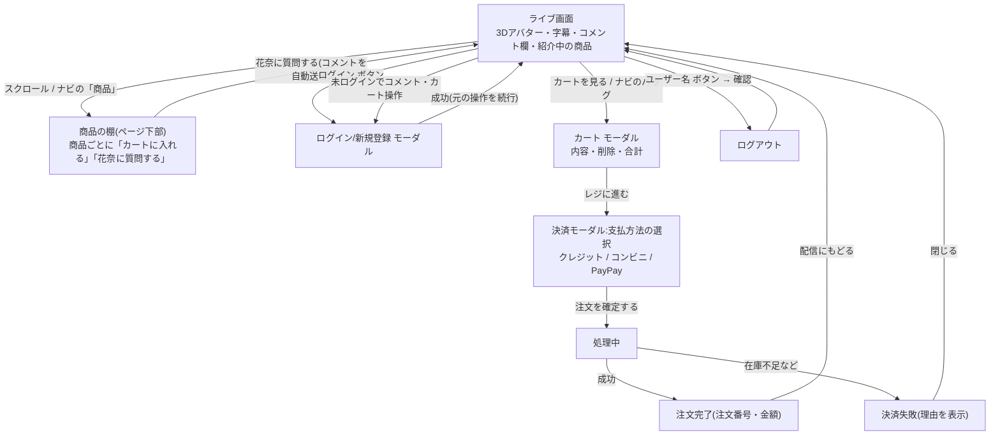
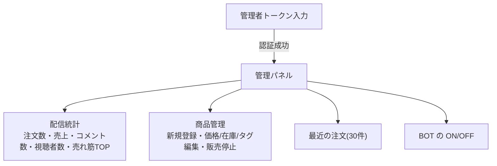

# 画面遷移図

## 視聴者ページ(/)
1 ページ構成(上から:ナビ → 大見出し → 商品の小さな一覧 → ライブ → 商品の棚 → お買い物ガイド → フッター)で、操作に応じてモーダルを開閉する。
スマホ幅(600px 以下)では縦 1 列になる。

```mermaid
flowchart TD
  L["ライブ画面<br/>3Dアバター・字幕・コメント欄・紹介中の商品"]
  SH["商品の棚(ページ下部)<br/>商品ごとに「カートに入れる」「花奈に質問する」"]
  L -- "スクロール / ナビの「商品」" --> SH
  SH -- "花奈に質問する(コメントを自動送信)" --> L
  L -- "ログイン ボタン" --> AU["ログイン/新規登録 モーダル"]
  L -- "未ログインでコメント・カート操作" --> AU
  AU -- "成功(元の操作を続行)" --> L
  L -- "カートを見る / ナビのバッグ" --> D["カート モーダル<br/>内容・削除・合計"]
  D -- "レジに進む" --> P1["決済モーダル:支払方法の選択<br/>クレジット / コンビニ / PayPay"]
  P1 -- "注文を確定する" --> P2["処理中"]
  P2 -- "成功" --> P3["注文完了(注文番号・金額)"]
  P2 -- "在庫不足など" --> P4["決済失敗(理由を表示)"]
  P3 -- "配信にもどる" --> L
  P4 -- "閉じる" --> L
  L -- "ユーザー名 ボタン → 確認" --> LO["ログアウト"] --> L
```

## 管理画面(/admin)

```mermaid
flowchart TD
  T["管理者トークン入力"] -- "認証成功" --> PNL["管理パネル"]
  PNL --> S["配信統計<br/>注文数・売上・コメント数・視聴者数・売れ筋TOP"]
  PNL --> PR["商品管理<br/>新規登録・価格/在庫/タグ編集・販売停止"]
  PNL --> OR["最近の注文(30件)"]
  PNL --> BOT["BOT の ON/OFF"]
```
