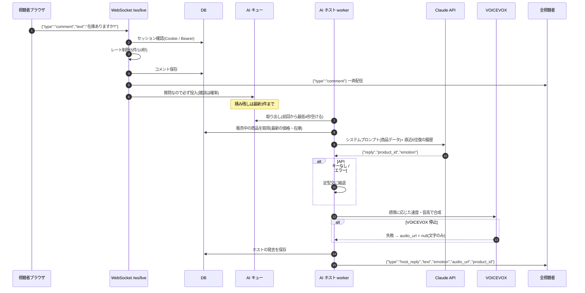
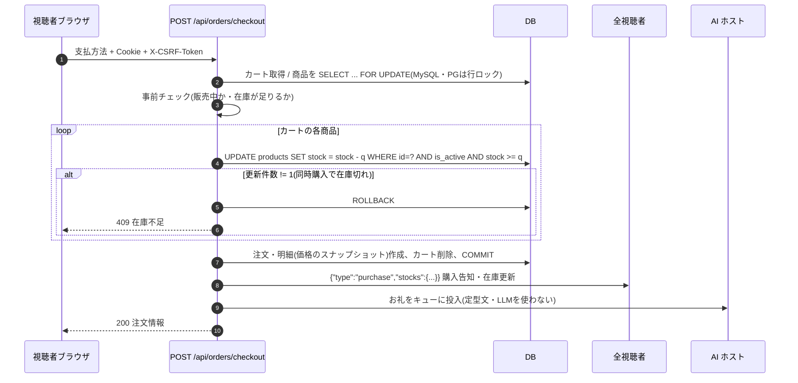
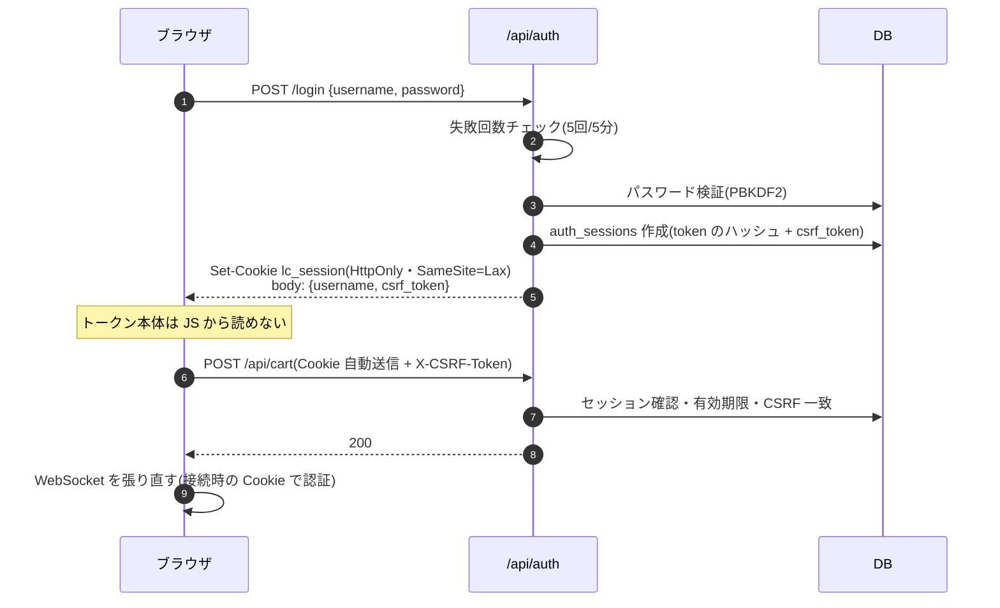

# シーケンス図

## 1. コメント → AI 回答 → 音声 → 全員に配信

```mermaid
sequenceDiagram
  autonumber
  participant B as 視聴者ブラウザ
  participant W as WebSocket /ws/live
  participant DB as DB
  participant Q as AI キュー
  participant H as AI ホスト worker
  participant C as Claude API
  participant T as VOICEVOX
  participant All as 全視聴者

  B->>W: {"type":"comment","text":"在庫ありますか?"}
  W->>DB: セッション確認(Cookie / Bearer)
  W->>W: レート制限(5件/10秒)
  W->>DB: コメント保存
  W->>All: {"type":"comment"} 一斉配信
  W->>Q: 質問なので必ず投入(雑談は確率)
  Note over Q: 積み残しは最新3件まで
  H->>Q: 取り出し(前回から最低4秒空ける)
  H->>DB: 販売中の商品を取得(最新の価格・在庫)
  H->>C: システムプロンプト(商品データ)+ 直近6往復の履歴
  C-->>H: {"reply","product_id","emotion"}
  alt API キーなし / エラー
    H->>H: 定型文に縮退
  end
  H->>T: 感情に応じた速度・音高で合成
  alt VOICEVOX 停止
    T-->>H: 失敗 → audio_url = null(文字のみ)
  end
  H->>DB: ホストの発言を保存
  H->>All: {"type":"host_reply","text","emotion","audio_url","product_id"}
```

## 2. 購入(売り越し防止)

```mermaid
sequenceDiagram
  autonumber
  participant B as 視聴者ブラウザ
  participant O as POST /api/orders/checkout
  participant DB as DB
  participant All as 全視聴者
  participant H as AI ホスト

  B->>O: 支払方法 + Cookie + X-CSRF-Token
  O->>DB: カート取得 / 商品を SELECT ... FOR UPDATE(MySQL・PGは行ロック)
  O->>O: 事前チェック(販売中か・在庫が足りるか)
  loop カートの各商品
    O->>DB: UPDATE products SET stock = stock - q WHERE id=? AND is_active AND stock >= q
    alt 更新件数 != 1(同時購入で在庫切れ)
      O->>DB: ROLLBACK
      O-->>B: 409 在庫不足
    end
  end
  O->>DB: 注文・明細(価格のスナップショット)作成、カート削除、COMMIT
  O->>All: {"type":"purchase","stocks":{...}} 購入告知・在庫更新
  O->>H: お礼をキューに投入(定型文・LLMを使わない)
  O-->>B: 200 注文情報
```

## 3. ログイン(Web)と更新系リクエスト

```mermaid
sequenceDiagram
  autonumber
  participant B as ブラウザ
  participant A as /api/auth
  participant DB as DB

  B->>A: POST /login {username, password}
  A->>A: 失敗回数チェック(5回/5分)
  A->>DB: パスワード検証(PBKDF2)
  A->>DB: auth_sessions 作成(token のハッシュ + csrf_token)
  A-->>B: Set-Cookie lc_session(HttpOnly・SameSite=Lax)<br/>body: {username, csrf_token}
  Note over B: トークン本体は JS から読めない
  B->>A: POST /api/cart(Cookie 自動送信 + X-CSRF-Token)
  A->>DB: セッション確認・有効期限・CSRF 一致
  A-->>B: 200
  B->>B: WebSocket を張り直す(接続時の Cookie で認証)
```
